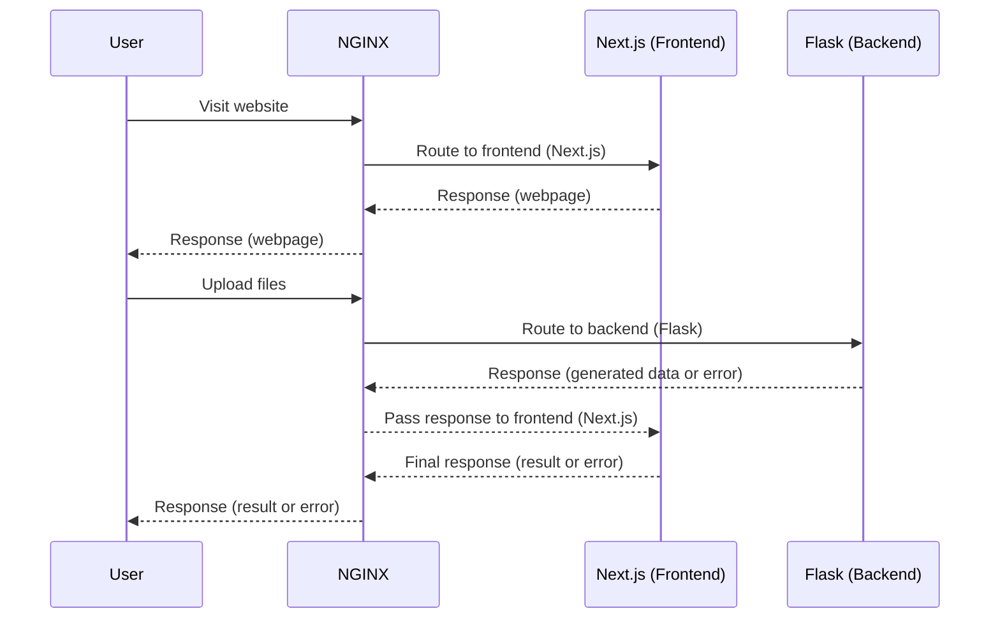

## The Nanocalc project

This repository contains the necessary files to setup and run the [Nanocalc website](https://nanocalc.org). Note that it doesn't include
the source code for the calculation logic of the web apps shown in the website (FRET-Calc, RI-Calc, PLQ-Sim and TMM-Sim).

For details regarding these, you may refer to their article preprints:

- [FRET-Calc PDF](https://github.com/NanoCalc/FRETCalc/blob/main/FRET.pdf)
- [RI-Calc PDF](https://github.com/NanoCalc/RICalc/blob/main/RI-Calc.pdf)
- [PLQ-Sim PDF](https://github.com/NanoCalc/PLQ-Sim/blob/main/PLQ-Sim.pdf)
- [TMM-Sim PDF](https://github.com/NanoCalc/TMM-Sim/blob/main/TMM%E2%88%92Sim%3A%20A%20Versatile%20Tool%20for%20Optical%20Simulation%20of%20Thin%E2%88%92Film%20Solar%20Cells.pdf)


## Building
You only need **Docker** to be installed. Then, you can build
the whole project by running the following command at the repository's
root:
```
docker-compose build
```

This will setup the Compose build made up by NGINX (for reverse proxying), the frontend (Next.js) and the backend (Flask).

Next, you may start the project by running:
```
docker-compose up -d
```

When you are done exploring it, bring all the containers down
for cleanup:
```
docker-compose down
```

## Architecture overview

